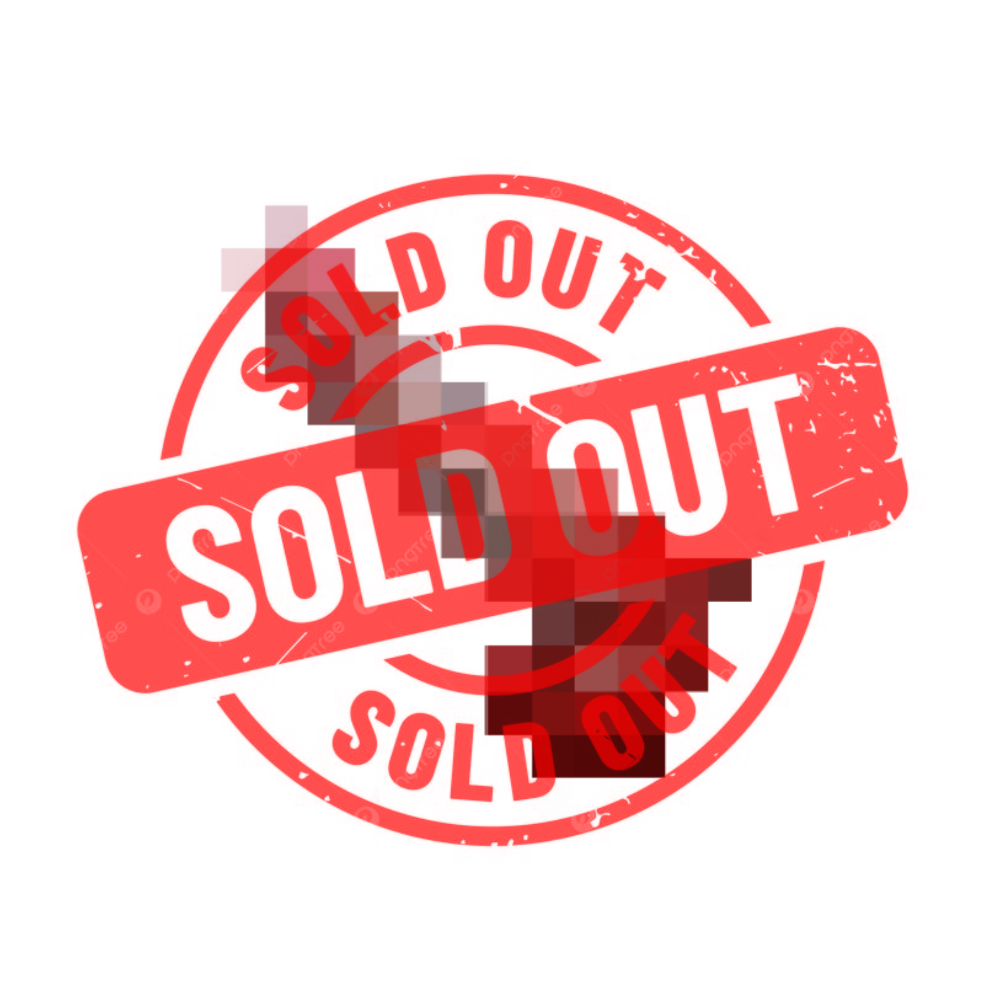
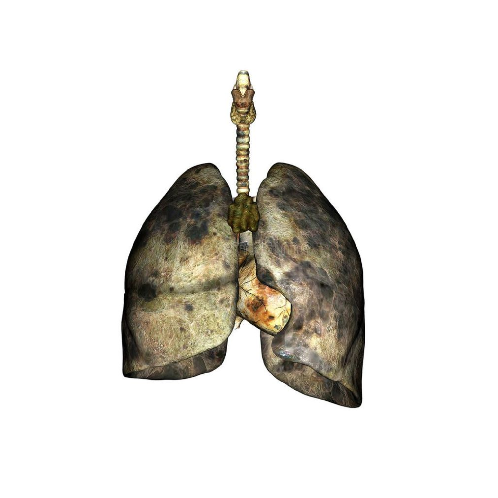
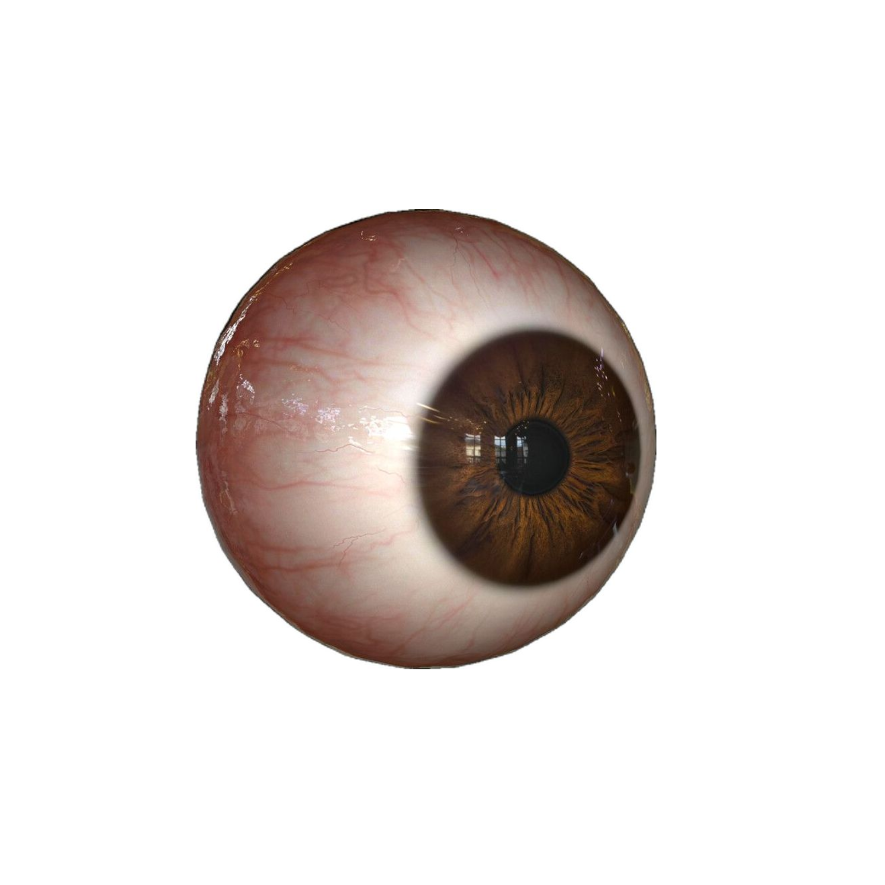
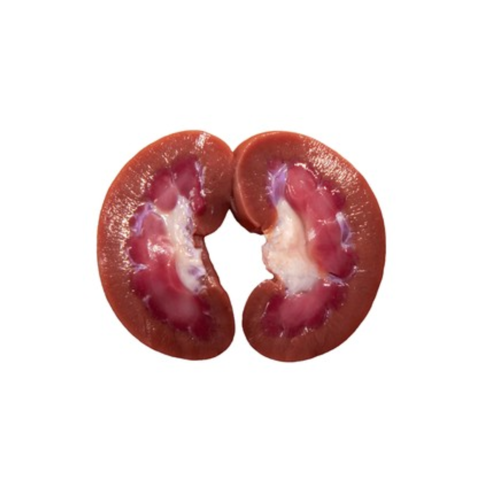

<!DOCTYPE html>
<html lang="fa">
<head>
    <meta charset="UTF-8">
    <meta name="viewport" content="width=device-width, initial-scale=1.0">

    <title>Totally Normal Store</title>

    
</head>

<body>

    <!-- HEADER -->

    <header>

        

        <nav>
            <a href="#" onclick="showMessage('به صفحه اصلی خوش آمدید.')">
                Home
            </a>

            <a href="#products" onclick="showMessage('چیزی برای دیدن نیست .')">
                Products
            </a>

            <a href="#" onclick="showMessage('اطلاعاتی درباره ما وجود ندارد.')">
                About
            </a>

            <a href="#" onclick="showMessage('لطفاً مزاحم نشوید.')">
                Contact
            </a>

            <!-- SEARCH ICON -->

            <button class="search-btn"
                    onclick="showMessage('🔍 توی بدن خودت دنبالش بگرد، اینجا چیزی نیست.')">
                🔍
            </button>
        </nav>

    </header>

    <!-- HERO -->

    <section class="hero">

        <h1>Welcome.</h1>

        

            Everything you need. Probably.
        

    </section>

    <!-- PRODUCTS -->

    <section class="products-section" id="products">

        

            <h2>Our Products</h2>
            
Quality products for absolutely no reason.

        

        

            <!-- PRODUCT 1 -->

            

                

                

                    
                        SOLD OUT
                    

                    <h3>Product One</h3>

                    

                        A completely normal product.
                    

                    

                        $29.99
                    

                    <button class="buy-btn sold-out"
                            onclick="showMessage('این محصول فروخته شده. حتی خودمون هم نمی‌دونیم به کی.')">
                        SOLD OUT
                    </button>

                

            

            <!-- PRODUCT 2 -->

            

                

                

                    <h3>Product Two</h3>

                    

                        Very useful. Probably.
                    

                    

                        $39.99
                    

                    <button class="buy-btn"
                            onclick="showMessage('به‌عنوان یه مدافع حقوق حیوانات، همچین کار غیرانسانی‌ای رو نمی‌ذارم بکنی. 🐦‍⬛‼️❌')">
                        Buy Now
                    </button>

                

            

            <!-- PRODUCT 3 -->

            

                

                

                    
                        SOLD OUT
                    

                    <h3>Product Three</h3>

                    

                        You missed your chance.
                    

                    

                        $49.99
                    

                    <button class="buy-btn sold-out"
                            onclick="showMessage('این یکی هم فروخته شده. واقعاً سریع خرید می‌کنید.')">
                        SOLD OUT
                    </button>

                

            

            <!-- PRODUCT 4 -->

            

                

                

                    <h3>Product Four</h3>

                    

                        Nobody knows what this does.
                    

                    

                        $59.99
                    

                    <button class="buy-btn"
                            onclick="showMessage('به‌عنوان یه مدافع حقوق حیوانات، همچین کار غیرانسانی‌ای رو نمی‌ذارم بکنی. 🐦‍⬛‼️❌')">
                        Buy Now
                    </button>

                

            

            <!-- PRODUCT 5 -->

            

                

                

                    <h3>Product Five</h3>

                    

                        Surprisingly expensive.
                    

                    

                        $69.99
                    

                    <button class="buy-btn"
                            onclick="showMessage('به‌عنوان یه مدافع حقوق حیوانات، همچین کار غیرانسانی‌ای رو نمی‌ذارم بکنی. 🐦‍⬛‼️❌')">
                        Buy Now
                    </button>

                

            

            <!-- PRODUCT 6 -->

            

                

                

                    <h3>Product Six</h3>

                    

                        We think it's useful.
                    

                    

                        $79.99
                    

                    <button class="buy-btn"
                            onclick="showMessage('به‌عنوان یه مدافع حقوق حیوانات، همچین کار غیرانسانی‌ای رو نمی‌ذارم بکنی. 🐦‍⬛‼️❌')">
                        Buy Now
                    </button>

                

            

            <!-- PRODUCT 7 -->

            

                

                

                    <h3>Product Seven</h3>

                    

                        Nobody asked for this.
                    

                    

                        $89.99
                    

                    <button class="buy-btn"
                            onclick="showMessage('به‌عنوان یه مدافع حقوق حیوانات، همچین کار غیرانسانی‌ای رو نمی‌ذارم بکنی. 🐦‍⬛‼️❌')">
                        Buy Now
                    </button>

                

            

            <!-- PRODUCT 8 -->

            

                

                

                    <h3>Product Eight</h3>

                    

                        The final mistake.
                    

                    

                        $99.99
                    

                    <button class="buy-btn"
                            onclick="showMessage('به‌عنوان یه مدافع حقوق حیوانات، همچین کار غیرانسانی‌ای رو نمی‌ذارم بکنی. 🐦‍⬛‼️❌')">
                        Buy Now
                    </button>

                

            

        

    </section>

    <!-- POPUP -->

    

        

            

            <button class="close-btn"
                    onclick="closeMessage()">
                فهمیدم
            </button>

        

    

    <!-- FOOTER -->

    <footer>

        

            © 2026 Totally Normal Store
        

    </footer>

    <!-- JAVASCRIPT -->

    

</body>
</html>
